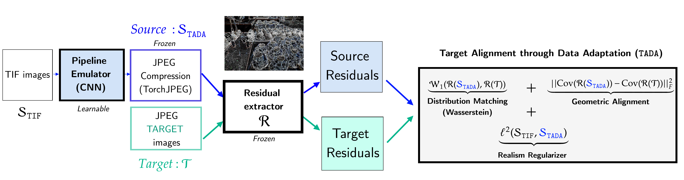

# Official repository for the paper :

## "Tackle CSM in JPEG Steganalysis with Data Adaptation"

### released at @[IH&MMSec '26](https://www.ihmmsec.org/) (Florence, Italy)

  

[](#CitingUs) [](https://arxiv.org/abs/2605.21523)

### Rony Abecidan, Vincent Itier, Jeremie Boulanger, Patrick Bas, Tomáš Pevný

This repository provides the **TADA training code**. In particular, the paper's toy **sharpen** experiment can be reproduced by following the instructions below.

## TADA overview



*TADA learns a lightweight convolutional emulator (followed by differentiable JPEG) so that residual statistics of the emulated source match those of the target, thereby reducing CSM.* (Figure 1 in the paper.)

## What This Code Reproduces

The command below trains a lightweight convolutional emulator from a generic RAW/TIF source toward the sharpened operational target:

```bash
python pipeline_learning_config.py sharpen100_bpnzac.yaml cuda
```

**Training budget:** for the **toy sharpen** experiment, `max_epochs: 100` in `sharpen100_bpnzac.yaml` is typically enough. For **operational targets** with a richer, more complex content distribution, do not hesitate to raise `max_epochs` substantially (e.g. thousands) and adjust `earlystop_patience` accordingly — convergence is slower and benefits from a longer training horizon.

The experiment corresponds to the toy sharpen target discussed in the paper. TADA aligns residual statistics between the developed source and the unlabeled target using:

- **covariance alignment** on KB residual patches (`lamb_cov`) — geometric matching of second-order residual structure;
- **correlation alignment** on KB residual patches (`lamb_corr`) — we found that adding this term on top of covariance **speeds up training**;
- **Wasserstein-1 / Earth Mover** distribution matching through `geomloss` (`lamb_mmd`) — **distribution matching** complementary to the geometric terms above;
- **realism** (`dev`) — the paper writes an L2 term between TIF and developed images; this repository uses **MMD on spatial patches** instead, which gave **better results in practice** by preventing developed images from drifting too far from the original TIF distribution (same `8x16` tiling as the other terms).

Training reads `512x512` images from HDF5 but extracts random `256x256` crops (`im_size_source`) mainly to keep GPU memory manageable. This does not change the learning objective: every loss term is computed on randomly sampled **`8x16` patches**, not on full images. A smaller crop only reduces the local patch pool per sample; with random crop positions, many epochs, and random patch sampling each batch, the estimated residual statistics remain representative.

Depending on CPU/GPU architecture, CUDA kernels, library versions, and the training seed, the learned pipeline may not converge to exactly the same kernel as the one reported in the paper. In practice, it should still converge toward a sharpen-like pipeline and drastically reduce the regret after fine-tuning a steganalysis detector with the adapted source.

Source and target tensors are augmented with rotations derived from the sample index; operational and PMAP share the same rotation, while the source rotation differs from the target one in the current implementation.

Early stopping monitors **covariance + Wasserstein** (`current_loss`) on the operational split; correlation and the realism term (`dev`) remain in `train_loss` but are not used for model selection.

## Installation

These instructions target a **Linux cloud GPU machine** (e.g. [Lambda Labs](https://lambdalabs.com/), RunPod, etc.). Training requires **CUDA** and a matching **PyTorch** build.

```bash
python3 -m venv .venv
source .venv/bin/activate

# Pick the wheel index that matches your driver/CUDA (cu124, cu121, …)
pip install torch torchvision --index-url https://download.pytorch.org/whl/cu124

pip install -r requirements.txt
```

Then place the HDF5 files (see [Data Layout](#data-layout)) and run:

```bash
python pipeline_learning_config.py sharpen100_bpnzac.yaml cuda
```

The repository includes a `timm/` folder: a vendored copy of the [timm](https://github.com/huggingface/pytorch-image-models) library (PyTorch Image Models). Its version string is **`0.5.4`** (`timm/version.py` in this repo).

## Data Layout

Both HDF5 files were **built from the same fixed pool of 2,000 RAW images randomly sampled from [ALASKA#2](https://utt.hal.science/hal-02950094)** (Cogranne, Giboulot, Bas, WIFS 2020). They are **not** the ALASKA#2 benchmark itself: each file stores preprocessed crops and targets derived from that subset. Users must comply with the **ALASKA#2 terms of use** when downloading or redistributing these derivatives.

The `.h5` files are **not committed to git** (see `.gitignore`). Download them from Zenodo:

**[TADA toy sharpen experiment — HDF5 training data](https://doi.org/10.5281/zenodo.20688394)**

Then place the files as follows:

```text
TADA/
  color_raws_512.hdf5
  targets/
    sharpen_full_stego.hdf5
```

Expected HDF5 keys:

```text
color_raws_512.hdf5
  train

targets/sharpen_full_stego.hdf5
  operational
  pmap_ope
  eval
  pmap_eval
```

The YAML file `sharpen100_bpnzac.yaml` points to these paths by default. The `training.target` field is written as `targets/sharpen.hdf5` and expanded at load time to `targets/sharpen_{scenario}.hdf5` (i.e. `sharpen_full_stego.hdf5` for this experiment).

`color_raws_512.hdf5` contains **2,000** color TIF crops (`512×512`) obtained from that **2,000-RAW ALASKA#2 subset** (demosaicked with `amaze`), chosen to be as spatially uniform as possible. The paper shows that 500 source images are enough: `sharpen100_bpnzac.yaml` randomly samples `training.n_samples: 500` TIFs from this pool at training time.

These crops are chosen to be **as uniform as possible**, but not perfectly flat: if they were entirely uniform, the residual statistics would carry little information and TADA could not learn a meaningful pipeline. The goal is rather to focus pipeline learning on development effects instead of being dominated by highly textured image content.

`targets/sharpen_full_stego.hdf5` corresponds to the toy sharpen target from the paper. It is built from the **same 2,000-RAW ALASKA#2 subset** (developed into `512×512` crops, converted to grayscale, sharpened with the kernel below, JPEG-compressed at quality factor 100, and fully embedded with UERD at 1 bpnzac). The file stores **1,000** images under `operational` for TADA training and reserves the other **1,000** under `eval` to keep evaluation disjoint and avoid overlap bias. By default, `operational.n_samples: 1000` uses the full operational pool.

```text
  0.00  -0.25   0.00
 -0.25   2.00  -0.25
  0.00  -0.25   0.00
```

## After TADA: building the steganalysis training set

This repository reproduces **pipeline learning** with TADA, not the full detector-training pipeline. In the paper, once the emulator is learned, the source used to train the steganalysis detector is built from the **same 2,000-RAW ALASKA#2 subset** as `color_raws_512.hdf5`, but with a different cropping strategy:

- **During TADA training** (`color_raws_512.hdf5`): crops are chosen to be **as uniform as possible** (`raw_uniform`), so pipeline learning is not dominated by highly textured content.
- **After TADA training** (paper evaluation protocol): the learned pipeline is applied to RAWs from that **same subset**, but crops are taken with the **ALASKA smart-crop procedure** ([Cogranne et al., 2020](https://utt.hal.science/hal-02950094)) to obtain **`512×512` textured regions**, closer to the content distribution of operational target images.

In short: same **2,000 randomly sampled ALASKA#2 RAWs**, uniform crops for TADA, smart crops for the final steganalysis training source.

## JPEG Quantization Tables

For the paper experiment, the default configuration uses JPEG quality factor 100. If you want to force the exact target quantization table, add one of the following optional fields under `training` in `sharpen100_bpnzac.yaml`:

```yaml
qf_table_txt: qtables/qf100_luma.txt
qf_chroma_table_txt: qtables/qf100_chroma.txt
```

The text files must contain 64 values arranged as an 8x8 quantization table, separated by spaces, commas, or newlines.

Alternatively, provide a JPEG image carrying the target table:

```yaml
qf_reference_image: examples/target_reference.jpg
```

When `qf_reference_image` is set, the code extracts the luminance and chrominance quantization tables from that image and uses them for the whole training run.

## YFCC100M / Flickr Images

`Data/flickr_yyc100m_images.txt` is reserved for the list of Flickr images from YFCC100M used in the operational experiments of the paper. The list is provided separately so that users can reconstruct the same image subset if they want to rerun the full data generation pipeline.

## Outputs

Training outputs are written to:

```text
Results/
```

The best learned emulator weights are saved as `best_model_epoch.pt` in the experiment subfolder, together with the resolved hyperparameters and loss history.

<a id="CitingUs"></a>

## Citing our paper

### If you wish to refer to our paper, please use the following BibTeX entry

```bibtex
@inproceedings{abecidan2026tada,
  title = {Tackle CSM in JPEG Steganalysis with Data Adaptation},
  author = {Abecidan, Rony and Itier, Vincent and Boulanger, Jeremie and Bas, Patrick and Pevny, Tomas},
  booktitle = {ACM Workshop on Information Hiding and Multimedia Security},
  year = {2026}
}
```

## Zenodo dataset (HDF5 files)

> Abecidan, R. (2026). *TADA toy sharpen experiment — HDF5 training data (ALASKA source + sharpen target, QF100, UERD 1 bpnzac)* [Data set]. 14th ACM Workshop on Information Hiding and Multimedia Security (IHMM&Sec), Firenze. Zenodo. https://doi.org/10.5281/zenodo.20688394

```bibtex
@dataset{abecidan2026tada_hdf5,
  author = {Abecidan, Rony},
  title = {TADA toy sharpen experiment --- HDF5 training data (ALASKA source + sharpen target, QF100, UERD 1 bpnzac)},
  year = {2026},
  publisher = {Zenodo},
  doi = {10.5281/zenodo.20688394},
  url = {https://doi.org/10.5281/zenodo.20688394},
  note = {14th ACM Workshop on Information Hiding and Multimedia Security (IHMM\&Sec), Firenze}
}
```

## ALASKA#2 (upstream benchmark)

The HDF5 files were built from **2,000 RAW images randomly drawn from ALASKA#2**. If you use these data, please also cite the upstream benchmark:

```bibtex
@inproceedings{alaska2,
  title = {{ALASKA#2: Challenging Academic Research on Steganalysis with Realistic Images}},
  author = {Cogranne, R{\'e}mi and Giboulot, Eva and Bas, Patrick},
  booktitle = {IEEE International Workshop on Information Forensics and Security (WIFS)},
  year = {2020},
  doi = {10.1109/WIFS49906.2020.9360896},
  url = {https://utt.hal.science/hal-02950094}
}
```

Download the original ALASKA#2 benchmark from the [official page](https://utt.hal.science/hal-02950094).
